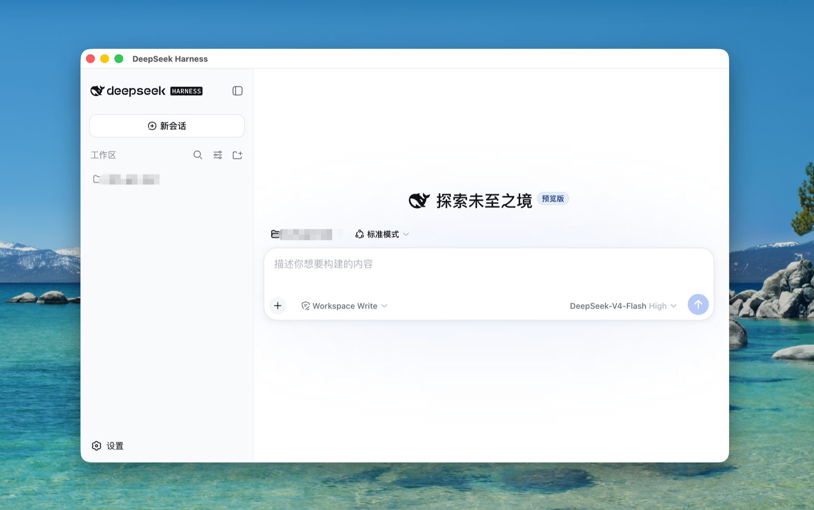
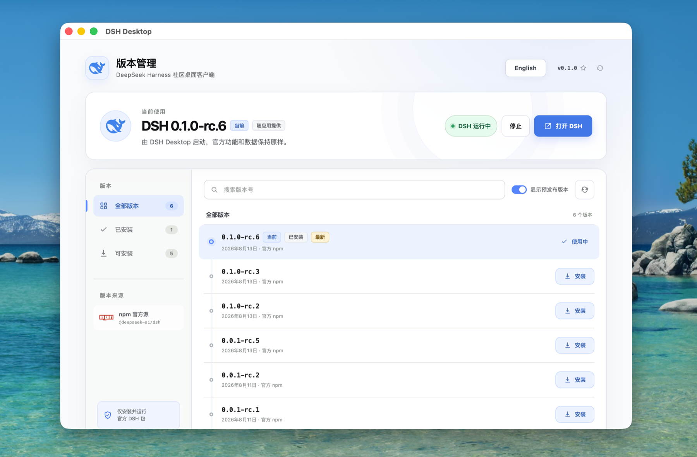
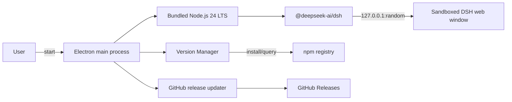

<p align="center">English | <a href="README.zh-CN.md">简体中文</a></p>

<div align="center">
  
  <h1>DSH Desktop</h1>
  <p>Run and manage the official DeepSeek Harness without installing Node.js.</p>
  <p align="center"><a href="https://github.com/qufei1993/dsh-desktop/actions/workflows/build.yml"></a>&nbsp;&nbsp;<a href="https://github.com/qufei1993/dsh-desktop/releases/latest"></a>&nbsp;&nbsp;<a href="LICENSE"></a></p>
</div>

DSH Desktop is a community-maintained DeepSeek Harness desktop client for macOS and Windows. It bundles Node.js 24 LTS, installs and retains official `@deepseek-ai/dsh` versions, and runs the official `dsh web` interface in a dedicated window.

> [!IMPORTANT]
> This project is maintained independently by the community and is not affiliated with DeepSeek. DSH Desktop does not modify DeepSeek Harness; the official DSH package continues to operate under its own license and behavior.

## Download and use

Download the installer for your system from [GitHub Releases](https://github.com/qufei1993/dsh-desktop/releases/latest):

| System | Installer |
| --- | --- |
| macOS Apple Silicon | `DSH-Desktop-*-arm64.dmg` |
| macOS Intel | `DSH-Desktop-*-x64.dmg` |
| Windows 10/11 x64 | `DSH-Desktop-Setup-*-x64.exe` |

After installation, DSH Desktop opens the official DeepSeek Harness interface directly. Open **Version Manager…** from the application menu when you need to install or switch DSH versions.

> [!NOTE]
> This project is at an early stage. If no installer is available under Releases yet, wait for the first public release. Building from source is not recommended for regular users.

## Screenshots

### Official DeepSeek Harness workspace

DSH Desktop launches the official DSH interface directly in a dedicated desktop window.



### Version Manager

Install, retain, and switch official DSH versions without changing the official interface or user data.



## Core features

- Cross-platform desktop client for official DeepSeek Harness on macOS and Windows.
- Bundled Node.js 24 LTS, so users do not need to install Node.js themselves.
- Install, keep, and switch official `@deepseek-ai/dsh` versions.
- Run official `dsh web` in a dedicated, sandboxed window.
- Bilingual UI (English / 简体中文) with manual switching.
- Built-in release update checks and SHA-256 checksum validation.

## Product boundaries

DSH Desktop manages the runtime, versions, and local process. It does not:

- fork, patch, rebuild, or inject code into official DSH;
- manage API keys, models, sessions, plugins, Skills, or MCP;
- read, migrate, back up, or delete DSH user data;
- silently upgrade or replace the DSH version selected by the user;
- expose the local DSH service to the LAN.

Official DSH and DSH Desktop use separate update channels. DSH versions come from npm and are installed by the user. DSH Desktop checks this repository's GitHub Releases only under user action.

> [!WARNING]
> Current installers are community builds without trusted Apple or Windows code-signing certificates. macOS is ad-hoc signed but not notarized and may require approval under **System Settings → Privacy & Security**. Windows may show an **Unknown publisher** or SmartScreen warning. Download the installer matching your operating system from the latest Release.

## Architecture



Official DSH runs only on local loopback (`127.0.0.1`) and uses minimal IPC.

## Local development

Developers need Node.js 22.19+ or 24+:

```bash
npm ci
npm run prepare:runtime
npm run dev
```

`prepare:runtime` downloads and validates the pinned Node.js 24 LTS runtime, then installs the bundled DSH version with that runtime. Generated files are stored under the ignored `build-resources/` directory.

Before submitting changes, run:

```bash
npm run verify
npm run test:official
```

`verify` runs consistency checks, type checking, automated tests, the production build, and the product-boundary audit. See [CONTRIBUTING.md](CONTRIBUTING.md), [SUPPORT.md](SUPPORT.md), and [CHANGELOG.md](CHANGELOG.md) for workflow.

Design details are in [docs/superpowers/specs/2026-08-15-dsh-desktop-design.md](docs/superpowers/specs/2026-08-15-dsh-desktop-design.md) and maintainers should also read [docs/RELEASING.md](docs/RELEASING.md).
