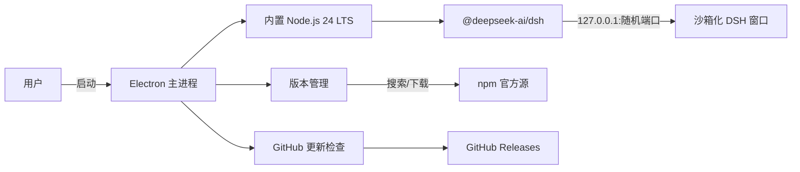

<p align="center"><a href="README.md">English</a> | 简体中文</p>

<div align="center">
  
  <h1>DSH Desktop</h1>
  <p>让普通用户无需安装 Node.js，也能直接运行和管理官方 DeepSeek Harness。</p>
  <p align="center"><a href="https://github.com/qufei1993/dsh-desktop/actions/workflows/build.yml"></a>&nbsp;&nbsp;<a href="https://github.com/qufei1993/dsh-desktop/releases/latest"></a>&nbsp;&nbsp;<a href="LICENSE"></a></p>
</div>

DSH Desktop 是由社区维护、面向 macOS 和 Windows 的 DeepSeek Harness 桌面客户端。应用自带 Node.js 24 LTS，可安装、保留和切换官方 `@deepseek-ai/dsh` 版本，并在独立窗口中运行官方 `dsh web` 页面。

> [!IMPORTANT]
> 本项目由社区独立维护，与 DeepSeek 官方无隶属关系。DSH Desktop 不修改 DeepSeek Harness；官方 DSH 仍按其自身许可证和行为运行。

## 下载与使用

前往 [GitHub Releases](https://github.com/qufei1993/dsh-desktop/releases/latest) 下载与你的系统匹配的安装包：

| 系统 | 安装包 |
| --- | --- |
| macOS Apple Silicon | `DSH-Desktop-*-arm64.dmg` |
| macOS Intel | `DSH-Desktop-*-x64.dmg` |
| Windows 10/11 x64 | `DSH-Desktop-Setup-*-x64.exe` |

安装并打开后，应用会直接进入官方 DeepSeek Harness 页面。需要安装或切换 DSH 版本时，从系统菜单打开“版本管理…”。

> [!NOTE]
> 项目尚处于早期阶段。如果 Releases 中暂时没有安装包，请等待首个公开版本，不建议普通用户从源码构建。

## 产品截图

### 官方 DeepSeek Harness 工作区

DSH Desktop 启动后会直接在独立桌面窗口中显示官方 DSH 界面。


### 版本管理

无需修改官方界面或用户数据，即可安装、保留和切换官方 DSH 版本。


## 核心能力

- 社区维护的 DeepSeek Harness 桌面客户端，支持 macOS 与 Windows。
- 应用内置 Node.js 24 LTS，用户无需自行安装 Node.js。
- 安装、保留并切换官方 `@deepseek-ai/dsh` 历史版本。
- 检测更新的官方 DSH 版本，在 DSH 工作区显示可关闭的更新提醒，并可从版本管理页更新。
- 在独立窗口中运行官方 `dsh web`，不改动官方界面。
- 简体中文 / English 双语界面，支持手动切换。
- 自带更新检查并校验 SHA-256。

## 清晰的产品边界

DSH Desktop 只负责运行环境、版本管理和进程托管。它不会：

- fork、patch、重新编译或向官方 DSH 页面注入代码；
- 管理 API Key、模型、会话、插件、Skills 或 MCP；
- 读取、迁移、备份或删除 DSH 用户数据；
- 自动升级或强制替换用户选择的 DSH 版本；
- 将本地 DSH 服务暴露到局域网。

官方 DSH 与 DSH Desktop 使用独立更新通道：DSH 版本来自 npm，由用户主动安装；DSH Desktop 仅在用户操作下检查本仓库 GitHub Releases。

> [!WARNING]
> 当前安装包是没有受信任 Apple 或 Windows 代码签名证书的社区构建。macOS 仅做 ad-hoc 签名、未经 Apple 公证，可能需要在“系统设置 → 隐私与安全性”中允许打开；Windows 可能显示“未知发布者”或 SmartScreen 提示。请从最新 Release 下载与系统匹配的安装包。

## 架构图



官方 DSH 仅在本地 `127.0.0.1` 与窗口通信，页面不直接暴露 Electron/Node.js API。

## 本地开发

仅开发者需要 Node.js 22.19+ 或 24+：

```bash
npm ci
npm run prepare:runtime
npm run dev
```

`prepare:runtime` 会下载并校验锁定的 Node.js 24 LTS，再使用该运行时安装随包 DSH。生成内容位于被 Git 忽略的 `build-resources/`。

提交改动前运行：

```bash
npm run verify
npm run test:official
```

`verify` 包含类型检查、自动测试、生产构建和产品边界审计。完整流程见[贡献指南](CONTRIBUTING.zh-CN.md)、[支持指南](SUPPORT.zh-CN.md)、[变更日志](CHANGELOG.zh-CN.md)。

完整边界说明见 [docs/superpowers/specs/2026-08-15-dsh-desktop-design.md](docs/superpowers/specs/2026-08-15-dsh-desktop-design.md)，维护发布流程请参考 [docs/RELEASING.zh-CN.md](docs/RELEASING.zh-CN.md)。
