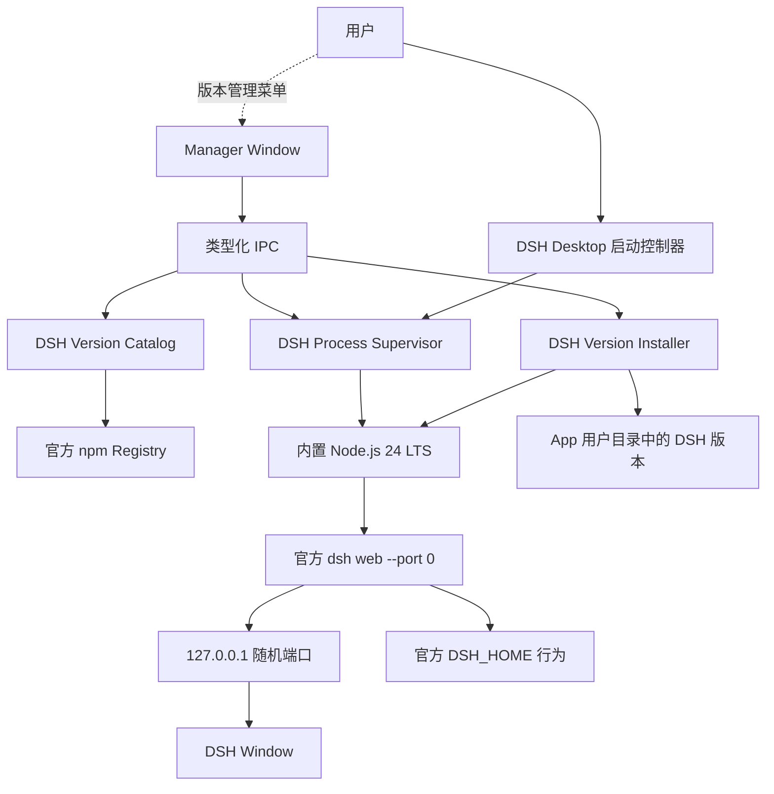

# DSH Desktop 设计说明

日期：2026-08-15

状态：已实现并完成首轮验证

## 1. 产品定义

DSH Desktop 是由社区维护的 DeepSeek Harness（简称 DSH）桌面客户端。

它只解决三件事：

1. 为普通用户提供内置 Node.js，无需自行安装运行环境。
2. 下载、保留和选择官方发布的 `@deepseek-ai/dsh` 版本。
3. 启动官方 `dsh web`，并在独立桌面窗口中展示官方 Web UI。

DSH Desktop 不实现 Agent、不修改 DSH、不接管 DSH 用户数据，也不为官方版本之间的兼容性提供私有修复。

## 2. 设计红线

以下约束高于其他产品需求：

- 不 fork DeepSeek Harness。
- 不修改、patch 或重新编译官方 DSH 包。
- 不注入、覆盖或替换官方 Web UI。
- 不导入 DSH 私有模块，不依赖未公开的内部 API。
- 不读写、复制、备份、迁移或删除 `DSH_HOME` 中的内容。
- 不管理 DSH 的 API Key、模型、会话、插件、Skills、MCP 或权限配置。
- 不为不同 DSH 版本创建私有数据格式。
- 不自动安装 DSH 更新，不强制用户升级。
- 不把本地 DSH 服务暴露到局域网。

生产环境不主动覆盖 `DSH_HOME`。子进程继承用户环境，若环境中已经存在 `DSH_HOME`，官方 DSH 自行使用它；否则由官方逻辑回退到 `~/.dsh`。

测试环境可以临时设置 `DSH_HOME`，但只用于避免自动化测试污染真实用户目录。

## 3. 首版范围

### 3.1 支持系统与构建目标

DSH Desktop 从首版开始同时支持 macOS 和 Windows。两套系统共用同一套 Electron、TypeScript 和 React 源码，不把操作系统支持拆成不同产品阶段。

首版分别生成和验证以下安装包构建目标：

- macOS arm64
- macOS x64
- Windows 10/11 x64

这里的 arm64 和 x64 是安装包的 CPU 架构目标，不是产品平台选择。不同目标需要分别携带对应的 Electron、Node.js 和 DSH 平台依赖，并分别完成安装、进程管理、签名与系统兼容性验证。

首版暂不生成 Linux、Windows arm64 和 Mac App Store 安装包。

### 3.2 用户能力

- 首次安装后无需系统 Node.js 即可运行。
- 安装包内含一个构建时固定、经过验证的官方 DSH 版本。
- 查看 npm 上公开的官方 DSH 版本。
- 收到官方新版本提示。
- 自主决定是否安装新版本。
- 同时保留多个已经安装的 DSH 版本。
- 在启动前选择任意已安装版本。
- 停止当前 DSH 进程并切换到其他版本。
- 删除不再需要的 DSH 程序版本。
- 查看安装和启动错误。

删除 DSH 程序版本只删除 DSH Desktop 管理的 npm 安装目录，绝不删除 `DSH_HOME`。

### 3.3 首版不做

- DSH 数据备份或恢复
- DSH 数据迁移
- DSH 配置编辑
- DSH 插件管理
- 多个 DSH 实例并行运行
- 官方 DSH 自动升级或静默升级
- 自定义 DSH 包源或第三方分发包
- 修改官方 DSH 启动参数的高级面板
- DSH Desktop 强制更新或静默更新

## 4. 技术方案选择

### 4.1 采用方案

采用 Electron 桌面运行宿主和独立标准 Node.js 运行时：

```text
Electron 主进程
  -> 标准 Node.js 24 LTS 子进程
    -> 官方 @deepseek-ai/dsh/lib/bin.js web --port 0
      -> http://127.0.0.1:<随机端口>
        -> 无 preload 的 Electron BrowserWindow
```

Node.js 使用官方预编译二进制，按操作系统和 CPU 架构分别打包。首版固定一个经过验证的 Node.js 24 LTS 小版本，不跟随系统 Node.js，也不在用户机器上执行全局安装。

### 4.2 不使用 Electron 内置 Node.js 运行 DSH

Electron 自带的 Node.js 服务于桌面主进程。让 DSH 直接运行在 Electron 的 Node.js 环境中，会把 DSH 与 Electron 的 Node.js、V8、原生模块 ABI 和升级节奏绑定。

独立 Node.js 运行时虽然增加安装包体积，但更接近官方运行方式，也更容易验证和回滚。

### 4.3 不使用 Tauri

Tauri 仍然需要额外携带 Node.js，同时引入 Rust、系统 WebView 差异和第二套打包工具链。它不能减少本项目最关键的 DSH 运行复杂度。

## 5. 系统架构



### 5.1 模块边界

#### Manager Window

只负责 DSH Desktop 的管理界面：

- 显示已安装版本
- 显示最新官方版本
- 展示安装进度
- 发起安装、启动、停止和切换命令
- 展示错误摘要

Manager Window 不是正常启动的首屏。App 优先直接启动当前所选官方 DSH 并显示 DSH Window；用户只在应用菜单中主动打开版本管理，或在没有可用版本、官方进程启动失败时看到 Manager Window。

#### Version Catalog

- 查询官方包 `@deepseek-ai/dsh` 的 npm 元数据。
- 只接受合法 SemVer。
- 区分已安装、未安装、当前最新和当前运行版本。
- 不把 `latest` 直接当作安装结果，安装时始终解析为确切版本号。

#### Version Installer

- 使用内置 Node.js 中的 npm CLI。
- 在 App 自己的临时目录安装确切 DSH 版本。
- 保留生成的 `package-lock.json`。
- 安装完成后验证官方 CLI 入口及 `dsh --version`。
- 验证成功后通过同一文件系统内的原子重命名发布版本目录。
- 失败、取消或 App 崩溃不会破坏已安装版本。
- 不触碰 `DSH_HOME`。

#### Process Supervisor

- 同一时间最多拥有一个 DSH 子进程。
- 使用绝对 Node.js 路径和绝对 DSH CLI 路径，不依赖系统 `PATH` 找 Node.js。
- 子进程继承用户环境，不覆盖 `DSH_HOME`。
- 启动参数固定为 `web --port 0`。
- 解析官方 stdout 输出的本地 URL。
- 校验 Host 必须是 `127.0.0.1`。
- 健康检查成功后才创建 DSH Window。
- 负责正常停止、超时终止和进程树回收。

#### DSH Window

- 只显示官方 DSH Web UI。
- 不提供 preload。
- 不向页面暴露 Electron 或 Node.js API。
- 不在页面上叠加 DSH Desktop 控件。

## 6. 文件与数据边界

DSH Desktop 只拥有自己的 App 数据：

```text
<Electron userData>/
├─ app-state.json
├─ versions/
│  ├─ 0.1.0-rc.5/
│  │  ├─ package.json
│  │  ├─ package-lock.json
│  │  └─ node_modules/
│  └─ 0.1.0-rc.6/
├─ temp/
└─ logs/
```

Node.js 和内置 DSH 资源随安装包放在 App resources 中。在线安装的版本位于 Electron `userData/versions`。

DSH 用户数据不属于以上目录设计。DSH Desktop 不计算其大小、不展示其内容，也不提供清理入口。

## 7. 官方一致性

生产启动与官方命令保持语义一致：

```text
官方：node <npm解析出的dsh入口> web
桌面：<内置node绝对路径> <已安装dsh入口绝对路径> web --port 0
```

唯一额外参数是 `--port 0`，这是官方公开支持的参数，用于让操作系统分配空闲端口，避免桌面 App 与已有服务发生固定端口冲突。

DSH Desktop 不修改官方配置层、profile、环境变量含义和 Web 请求。

若某个官方版本升级后出现数据不兼容、插件不兼容或启动错误，DSH Desktop只显示该官方进程的错误摘要，不修改用户数据进行补救。

## 8. 版本更新模型

官方 DSH 与 DSH Desktop 自身使用两套独立的版本和更新状态，不共用安装目录，也不互相改变选择结果。

### 8.1 检查更新

- App 启动后异步查询官方 npm Registry。
- 查询失败不影响已安装版本运行。
- 新版本只产生提示，不自动安装。
- 预发布版本保留完整版本号和预发布标记。
- 用户可以忽略某个版本提示。

### 8.2 安装更新

- 用户点击安装后才下载。
- 安装使用确切版本号。
- 新版本安装在新目录，不覆盖旧版本。
- 安装成功后不自动切换当前选择，除非用户明确选择“安装并启动”。

### 8.3 回退版本

- 用户从已安装版本列表选择旧版本。
- 当前进程停止后，启动所选旧版本。
- DSH Desktop 不改变旧版本将要读取的官方用户数据。
- 由官方 DSH 决定数据是否兼容。

### 8.4 DSH Desktop 自身更新

- 更新源只使用本仓库的正式 GitHub Releases。
- 正式安装版启动后异步检查一次，用户也可从应用菜单主动检查。
- 发现新版只提示，用户点击后才下载；下载完成后仍由用户决定何时重启安装。
- macOS arm64、macOS x64 使用独立更新清单，Windows x64 使用默认稳定通道。
- 应用更新前先停止由 DSH Desktop 托管的官方 DSH 子进程，但不读取或修改 DSH 用户数据。
- 开发模式禁用更新，草稿 Release 不作为正式更新。

### 8.5 网络代理

- GitHub 应用更新、npm 版本目录查询和官方 DSH 包安装使用同一代理决策。
- 优先读取标准代理环境变量，其次使用 macOS/Windows 系统代理。
- 系统为直连时探测 `127.0.0.1:7890`，端口可用则作为本地 HTTP 代理。
- 官方 DSH 的 `127.0.0.1` 页面使用直连会话，不经过外部代理。

## 9. 窗口模型

采用两个 BrowserWindow，隔离桌面管理能力与官方页面。

正常启动只展示 DSH Window。Manager Window 按需创建，不作为进入官方页面的中间步骤。

### 9.1 Manager Window

- 加载 DSH Desktop 自己的本地 React 页面。
- `contextIsolation: true`
- `nodeIntegration: false`
- `sandbox: true`
- preload 只暴露逐项定义的类型化 API。
- IPC 主进程校验 sender、消息 schema 和当前状态。

### 9.2 DSH Window

- `contextIsolation: true`
- `nodeIntegration: false`
- `sandbox: true`
- 无 preload
- 只允许本次 DSH Origin 内导航
- 拒绝摄像头、麦克风、定位等权限
- 新窗口默认拒绝
- 用户点击的 HTTPS 外部链接经过协议校验后交给系统浏览器
- 允许官方页面下载用户主动导出的文件

关闭 DSH Window 时停止其对应 DSH 子进程，不自动打开 Manager Window。版本管理始终可以从应用菜单进入。

## 10. 进程状态机

```text
idle
  -> installing
  -> ready
  -> starting
  -> running
  -> stopping
  -> ready

任何阶段失败 -> error -> ready 或 idle
```

非法状态转换必须被拒绝。例如运行中不能删除当前版本，安装中不能启动同一版本，停止完成前不能启动另一个版本。

应用使用 Electron 单实例锁，防止两个 DSH Desktop 进程同时修改版本目录。

## 11. 启动和停止

### 11.1 启动

1. 校验所选版本已完整安装。
2. 校验内置 Node.js 可执行。
3. 组装绝对 CLI 入口和 `web --port 0` 参数。
4. 继承用户环境并启动子进程。
5. 使用按行、跨 chunk 的解析器读取 stdout。
6. 只接受官方格式且 Host 为 `127.0.0.1` 的 URL。
7. 请求首页并验证 HTTP 200 与 DSH 启动标记。
8. 创建无 preload 的 DSH Window。

启动超时、端口不可访问、URL 非法或子进程提前退出时，不打开页面，返回 Manager Window 并显示可操作错误。

### 11.2 停止

1. 禁止重复停止。
2. 请求子进程正常退出。
3. 在有限时间内等待退出和端口释放。
4. 超时后终止进程树。
5. Windows 必须验证没有残留 Node.js 子进程。
6. 清理窗口和内存日志。

Windows 的优雅停止和进程树回收在真实平台完成契约验证，不用 macOS 上的模拟结果替代。

## 12. 环境继承

DSH 运行终端命令时需要看到用户常用的 `PATH`。

- Windows 继承桌面进程的用户环境。
- macOS 从用户登录 shell 获取一次启动环境，并与 App 环境合并。
- 不打印或持久化完整环境变量。
- 不覆盖已经存在的 `DSH_HOME`。
- 不把 DSH Desktop 自己的构建变量传入 DSH 子进程。

环境读取失败时使用 Electron 进程环境继续启动，并在诊断中记录不含变量值的警告。

## 13. 技术栈

- Electron
- TypeScript
- React
- electron-vite
- electron-builder
- Zod
- Vitest
- Playwright
- npm
- GitHub Actions

不引入通用状态管理框架。首版状态规模有限，由主进程状态机和 Renderer 内的小型 store 管理。

## 14. 源码目录

```text
src/
├─ main/
│  ├─ index.ts
│  ├─ windows/
│  │  ├─ manager-window.ts
│  │  └─ dsh-window.ts
│  ├─ runtime/
│  │  ├─ orchestrator.ts
│  │  ├─ process-supervisor.ts
│  │  ├─ output-parser.ts
│  │  ├─ health-check.ts
│  │  └─ shell-environment.ts
│  ├─ versions/
│  │  ├─ catalog.ts
│  │  ├─ installer.ts
│  │  ├─ remover.ts
│  │  └─ bundled-version.ts
│  ├─ storage/
│  │  ├─ app-state.ts
│  │  └─ paths.ts
│  ├─ ipc/
│  │  ├─ handlers.ts
│  │  └─ schemas.ts
│  └─ security/
│     ├─ navigation.ts
│     └─ permissions.ts
├─ preload/
│  └─ manager.ts
├─ renderer/
│  ├─ index.html
│  └─ src/
└─ shared/
   ├─ contracts.ts
   └─ version.ts

resources/
├─ node/
└─ bundled-dsh/

scripts/
├─ prepare-node-runtime.ts
├─ prepare-bundled-dsh.ts
└─ verify-bundle.ts

tests/
├─ unit/
├─ integration/
├─ contract/
└─ e2e/
```

项目中不得出现用于操作 `DSH_HOME` 内容的模块。

## 15. 日志和隐私

DSH Desktop 默认不记录：

- 用户提示词
- DSH 会话内容
- API Key
- 完整环境变量
- DSH_HOME 文件内容

持久日志只记录：

- DSH Desktop 版本
- 操作系统和架构
- 内置 Node.js 版本
- 所选 DSH 版本
- 安装和启动阶段
- 子进程退出码
- 脱敏后的错误摘要

子进程 stderr 使用有限大小的内存环形缓冲区。只有用户主动导出诊断时才写入脱敏后的错误片段。

## 16. 验证策略

### 16.1 单元测试

- SemVer 解析、比较和排序
- npm 元数据 schema 校验
- 安装路径和资源路径解析
- stdout 跨 chunk 解析
- URL Host 白名单
- 状态机合法与非法转换
- IPC schema 和 sender 校验
- 日志脱敏
- 临时安装目录识别
- 环境合并时不覆盖 `DSH_HOME`

### 16.2 集成测试

使用假的 DSH CLI 进程覆盖：

- 正常输出启动 URL
- URL 跨多个 stdout chunk
- 输出多个无关日志后再输出 URL
- 非法 Host
- 无输出超时
- 启动前崩溃
- 健康检查失败
- 停止超时
- 并发启动
- 并发安装同一版本
- 安装取消
- App 在安装中崩溃后的恢复
- 发布目录原子替换失败
- 删除运行中的版本被拒绝

### 16.3 官方 DSH 契约测试

对安装包内置版本以及计划推荐的新版本执行真实官方命令：

```text
<bundled-node> <official-dsh-bin> web --port 0
```

验证：

- 清空系统 `PATH` 中的 Node.js 后仍可启动。
- 启动地址为 `127.0.0.1` 随机端口。
- 首页返回 HTTP 200。
- 页面包含 DSH 启动标记。
- 静态资源可以加载。
- 不由 DSH Desktop 注入页面脚本。
- 测试专用 `DSH_HOME` 产生的数据全部来自官方 DSH 进程。
- 停止后端口释放。
- 进程退出后没有残留子进程。

生产代码必须没有创建、读取或修改 DSH_HOME 内容的调用路径。

### 16.4 Electron E2E

- 首次启动直接显示内置官方 DSH 页面。
- 版本管理页只通过应用菜单或启动失败兜底打开。
- 无系统 Node.js 时启动内置版本。
- Manager Window 只能调用白名单 IPC。
- DSH Window 没有 preload 和 Node.js API。
- 安装第二个官方版本。
- 安装后旧版本仍存在。
- 新版本提示不会自动安装。
- 用户忽略更新后仍能启动旧版本。
- 用户切换版本时启动了正确的 CLI 路径。
- 外部导航被拦截。
- DSH 崩溃后 Manager Window 展示错误并可重试。
- App 重启后保留已安装版本列表和用户选择。

### 16.5 各构建目标安装包验收

| 平台 | 环境 | 验收内容 |
|---|---|---|
| macOS arm64 | 未安装 Node.js、离线 | 安装、启动内置 DSH、停止、再次启动 |
| macOS x64 | 未安装 Node.js | 安装、官方 UI、外部链接、卸载 |
| Windows 10 x64 | 未安装 Node.js | NSIS 安装、启动、停止、无残留进程 |
| Windows 11 x64 | 中文用户名和含空格路径 | 安装版本、切换版本、卸载 |

### 16.6 发布门槛

- TypeScript 类型检查通过
- 单元测试通过
- 集成测试通过
- 官方 DSH 契约测试通过
- Electron E2E 通过
- macOS 与 Windows 的三个构建目标全部通过
- 安装包 smoke test 通过
- 第三方许可证清单生成
- 安装包 SHA-256 生成
- README 与 Release 明确披露 macOS 和 Windows 安装包未使用付费平台证书
- macOS Gatekeeper 与 Windows SmartScreen 的安装路径完成真实机器验证

当前项目不购买平台开发者证书，正式 Release 允许使用未签名社区构建，但必须提供 SHA-256、SBOM 和清晰的系统安全提示。

## 17. 构建与发布

GitHub Actions 使用同一份源代码分别生成三个构建目标：

- macOS arm64
- macOS x64
- Windows x64

产物：

- macOS DMG
- macOS ZIP
- Windows NSIS EXE
- SHA-256 校验文件
- 第三方许可证和 SBOM

DSH Desktop 的应用更新与 DSH 包更新是两条独立通道。应用自身通过 GitHub Releases 检查更新，不做强制或静默更新。Windows 可由用户触发应用内下载和安装；由于未使用 Apple Developer ID，macOS 检测到新版后打开 Release 页面，由用户手动下载安装。Git 标签必须与应用版本一致。

推送 `v*` 标签后，GitHub Actions 先校验标签、应用版本和 Changelog 章节，再执行三个目标的构建。全部成功后汇总安装包、更新清单、blockmap、SBOM 与三平台 SHA-256，Release 正文只使用 `CHANGELOG.md` 中对应版本的内容。任一版本信息缺失或不一致时停止发布。

## 18. 验收标准

首版完成必须同时满足：

1. 一台没有安装 Node.js 的干净电脑可以安装并打开 DSH Desktop。
2. 无网络时可以启动安装包内置的官方 DSH 版本。
3. 看到的是未经修改的官方 DSH Web UI。
4. 可以查看、安装和保留多个官方 DSH 版本。
5. 发现新版本后只提示，不自动安装。
6. 用户可以继续使用或切回旧版本。
7. DSH Desktop 不读写或迁移 DSH_HOME 数据。
8. App 退出后没有遗留 DSH 或 Node.js 进程。
9. DSH Desktop 能独立检查自身更新，且未经用户操作不会下载或安装。
9. macOS 和 Windows 安装包都通过真实系统 smoke test。

## 19. 实现顺序

设计确认后，按以下顺序编写实施计划：

1. 项目骨架、类型化 IPC 和状态机。
2. 假 DSH CLI 下的进程监督与窗口安全。
3. 内置 Node.js 和固定官方 DSH 契约测试。
4. npm 官方版本目录、安装、保留与切换。
5. Manager Window 用户界面。
6. macOS 和 Windows 打包流水线。
7. 安装包验收、签名、公证和发布文档。

实现过程中任何需要读取或修改 DSH_HOME 的需求，都视为超出当前产品范围，必须重新获得用户批准。

## 20. 参考资料

- DeepSeek Harness：<https://github.com/deepseek-ai/deepseek-harness>
- 官方运行说明：<https://github.com/deepseek-ai/deepseek-harness/blob/master/README.zh.md>
- 官方 CLI 说明：<https://github.com/deepseek-ai/deepseek-harness/blob/master/apps/cli/README.zh.md>
- DSH_HOME 说明：<https://github.com/deepseek-ai/deepseek-harness/blob/master/packages/util/home-paths/README.zh.md>
- Electron 安全指南：<https://www.electronjs.org/docs/latest/tutorial/security>
- Electron BrowserWindow：<https://www.electronjs.org/docs/latest/api/browser-window>
- Node.js 发布周期：<https://nodejs.org/en/about/previous-releases>
- electron-vite：<https://electron-vite.org/guide/>
- Playwright Electron API：<https://playwright.dev/docs/api/class-electron>

## 21. 实现与验证记录

2026-08-15 完成首版实现。源码位于 `src/`，资源准备和验证脚本位于 `scripts/`，跨平台流水线位于 `.github/workflows/build.yml`。

本机验证结果：

- TypeScript 类型检查通过。
- Vitest 5 个测试文件、6 个测试用例通过。
- 生产构建和产品边界审计通过。
- Node.js v24.18.1 官方发行包下载及 SHA-256 校验通过。
- `@deepseek-ai/dsh@0.1.0-rc.6` 精确安装和包身份校验通过。
- 真实官方 DSH Web 冒烟通过，返回 HTTP 200 和 `window.__DSH_BOOT__`。
- macOS arm64 打包端到端测试通过，覆盖管理界面、随包版本发现、官方窗口启动及关窗停止。
- 生成 382MB 的未签名开发 DMG，并通过 `hdiutil verify` 完整性校验。

Windows x64 与 macOS x64 的构建、打包端到端测试由同一份 GitHub Actions 矩阵在对应原生 runner 执行。稳定 Release 仍以配置平台签名凭据为前置条件。
